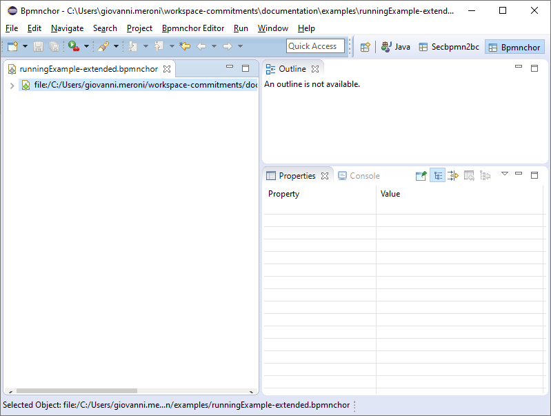
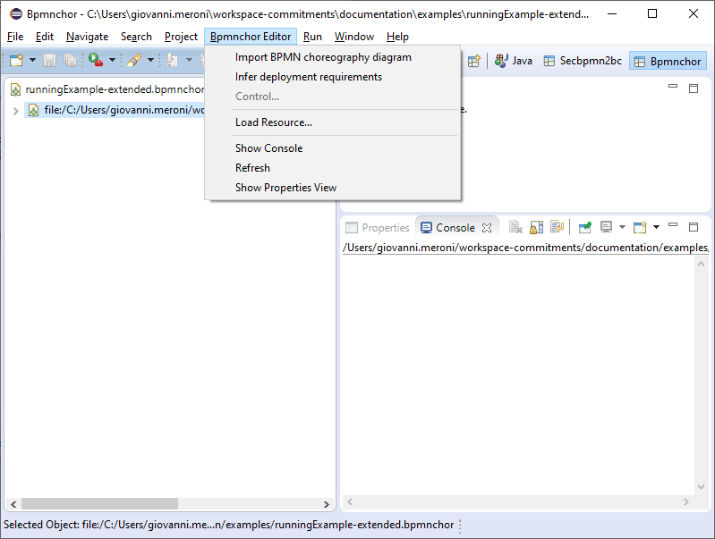
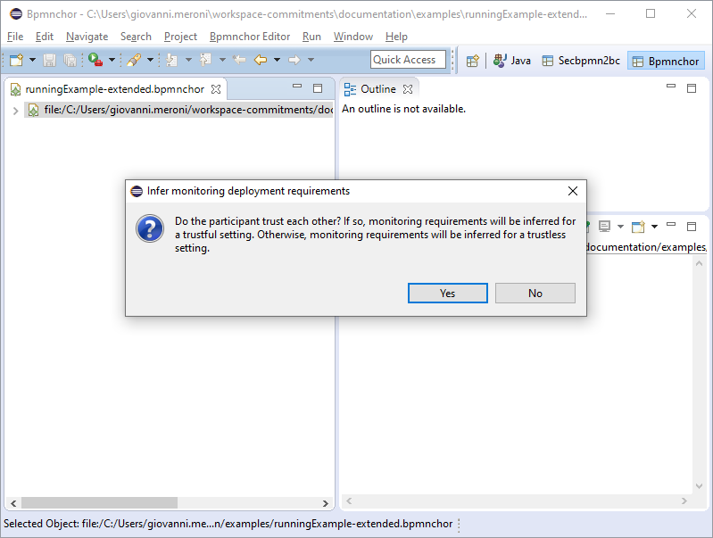
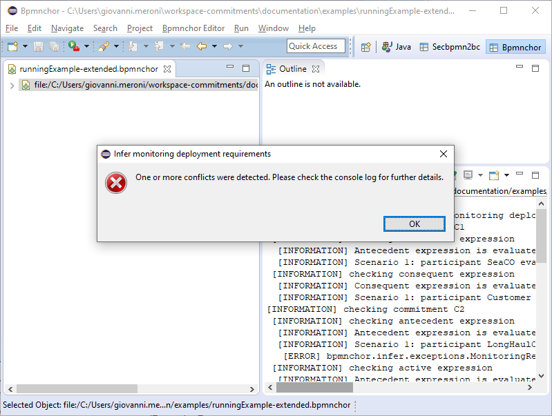
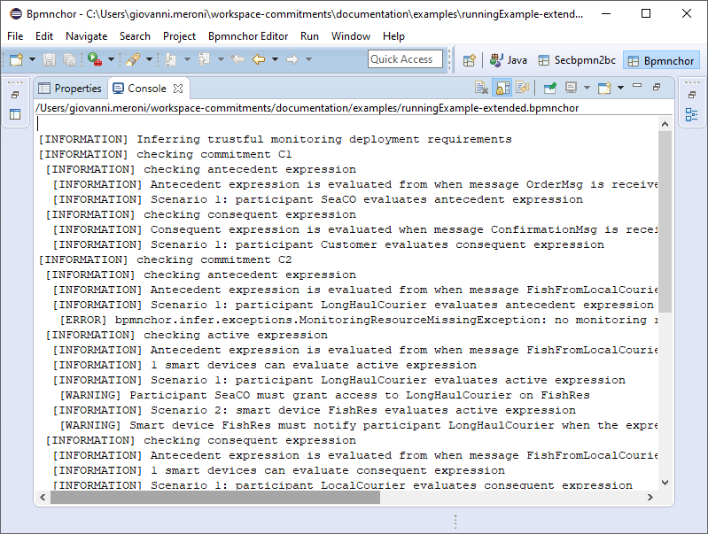

# Welcome to the bpmnchor-tc page!

bpmnchor-tc is an editor and checker for modeling BPMN choreography compliant timed commitments. In addition, it allows to derive requirements for IoT smart devices in charge of monitoring such timed commitments.

## Repository content
This repostory contains:
* this guide
* the compiled version of the software tool 
* source code of the software tool
* several example files, that can be used to try the tool.

## Requirements
This is the software configuration tested. Other software versions or operating systems are not supported.
* Eclipse 4.5.2
  * BPMN2 Metamodel
  * BPMN2 Modeler - Diagram Editor
* Java 8
* Windows 10
Note that the tool can also be used as a standalone console application. In this case, Eclipse is not required. However, it only allows to derive requirements from an existing model.

## Installation and set-up instructions
As an Eclipse plugin:
1. Download the last bpmnchor-tc-plugin zip file from here: https://github.com/plebanip/isolab-commitment-bpmn-checker/releases
2. Copy the zip file inside Eclipse root directory and expand it there.
3. Start Eclipse
4. check if the plugin is installed: verify (do not click) if in the *File* -> *New* exists an element *Bpmnchor model*
5. Open bpmnchor-tc perspective: *Window* -> *Perspective* ->  *Open Perspective * -> *Other* -> *Bpmnchor
  
As a standalone console application:
1. Download the last bpmnchor-tc-standalone jar file from here: https://github.com/plebanip/isolab-commitment-bpmn-checker/releases

## Usage (Eclipse plugin editor)
1. Open Eclipse with bpmnchor-tc plugin installed.
2. Open the Bpmnchor-tc example files: *File* -> *Open File* and choose one of the Bpmnchor-tc files in */documentation/examples*.
Your Eclipse interface should now be similar to the following screenshot:

3. If the console pane is not open in Eclipse, open it: *Bpmnchor Editor* -> *Show console*.
4. Select menu option to derive requirements for IoT smart devices in the process: *Bpmnchor Editor* -> *Infer deployment requirements*.

5. To determine the appropriate ruleset to derive the requirements, a dialog box will ask you if the participants should trust each other (trustful monitoring) or they should not (trustless monitoring).

6. Once the analisys is completed, a dialog box will confirm that the analysis completed successfully, or if there are any issues in the process model.

7. After the analysis is complete, requirements will be shown in the console pane.

## Usage (standalone console application)
1. Open the command prompt (or another terminal, e.g., PowerShell)
2. Navigate to the folder where the bpmnchor-tc-standalone jar file has been downloaded
3. To derive requirements for trustful monitoring (organizations in the process trust each others), execute the following command:

  `java -jar bpmnchor-tc-standalone.jar URI trustful`
  
  To derive requirements for trustless monitoring (organizations in the process do not trust each others), execute the following command instead:

  `java -jar bpmnchor-tc-standalone.jar URI trustless`
  
  URI is the uri of the bpmnchor-tc model to analyze (e.g., https://raw.githubusercontent.com/plebanip/isolab-commitment-bpmn-checker/blob/master/documentation/examples/runningExample-extended.bpmnchor)

4. Requirements are outputted as text (stdout).

